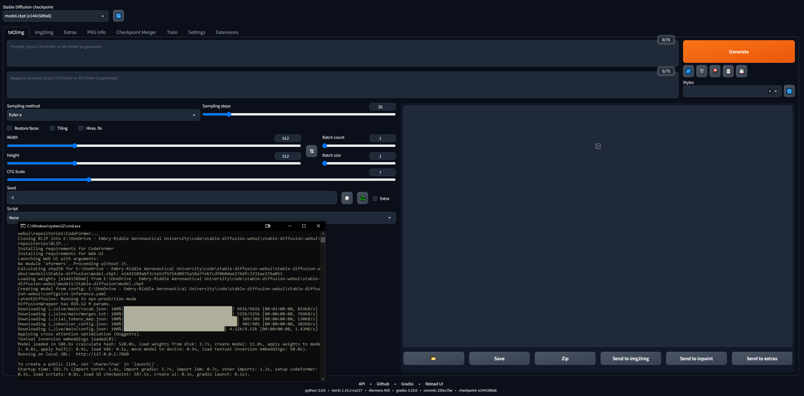
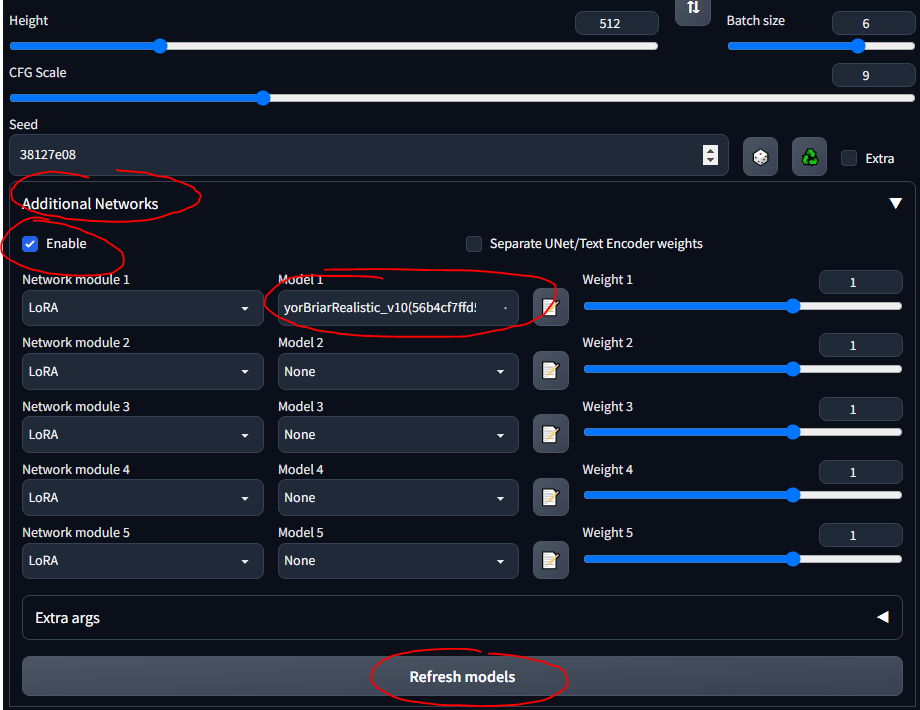
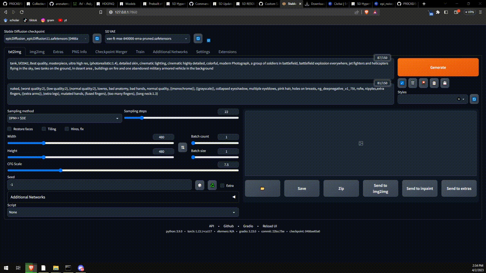
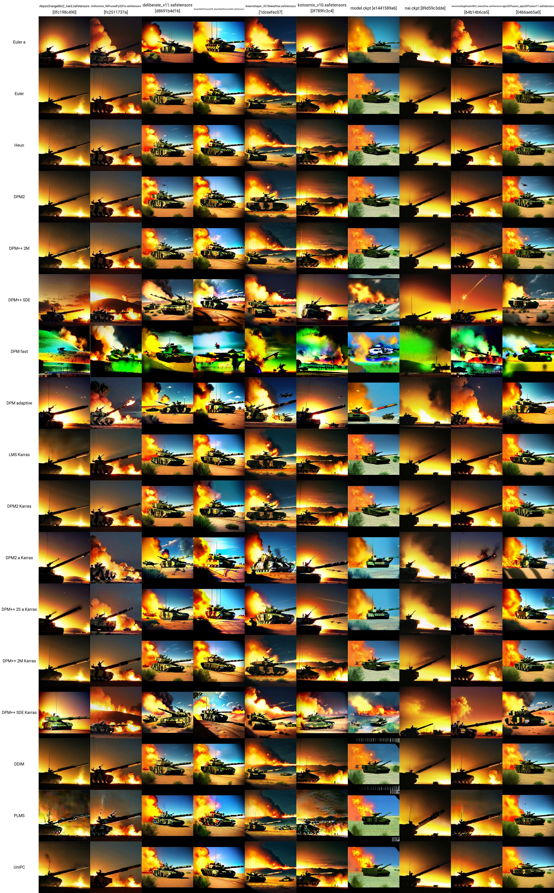
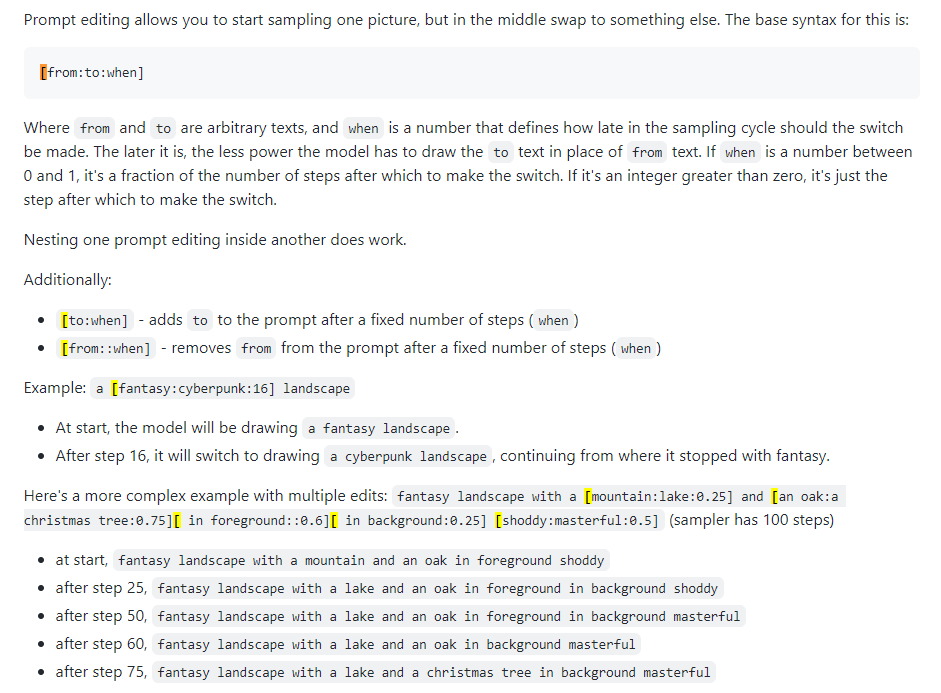
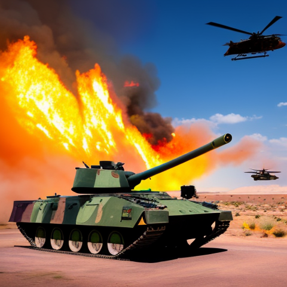
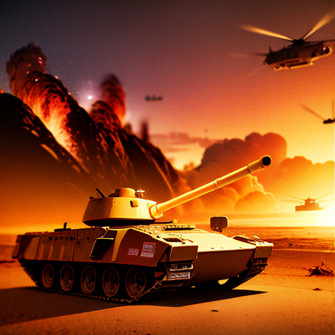

# Stable Diffusion End-to-End Guide - From Noob to Expert
I became interested in using SD to generate images for military applications. Most of the resources are taken from 4chan's NSFW boards, as anons use SD to make hentai. Interestingly, the canonical SD WebUI has built-in functionality with anime/hentai image boards... One of the first use cases of SD right after DALL-E was generating anime girls, so the jump to hentai is not surprising. 

Anyhow, the techniques from these weirdos are applicable to a variety of applications, most specifically LoRAs, which are like model fine-tuners. The idea is to work with specific LoRAs (e.g., military vehicles, aircraft, weapons, etc.) to generate synthetic image data for training vision models. Training new, useful LoRAs is also of interest. Later stuff may include inpainting for perturbation.

## Disclaimer
```Every link here may contain NSFW content, as most of the cutting-edge work on SD and LoRAs is with porn or hentai. So, please be wary when you are working with these resources.```

-TP

# Play With It!
What can you actually do with SD? Huggingface and some others have some apps in-browser for you. Play around with them to see the power! What we will do in this guide is get the full, extensible WebUI to allow us to do anything we want.
* [Huggingface Text to Image SD Playground](https://huggingface.co/spaces/stabilityai/stable-diffusion)
* [Dreamstudio Text to Image SD App](https://beta.dreamstudio.ai/generate)
* [Dezgo Text to Image SD App](https://dezgo.com/)
* [Huggingface Image to Image SD Playground](https://huggingface.co/spaces/huggingface-projects/diffuse-the-rest)
* [Huggingface Inpainting Playground](https://huggingface.co/spaces/fffiloni/stable-diffusion-inpainting)

# Table of Contents
1. [The Basics](#the-basics)
    1. [Set up Local GPU usage](#set-up-local-gpu-usage)
    2. [Going Deeper](#going-deeper)
    3. [NovelAI Model](#novelai-model)
    4. [LoRA](#lora)
    5. [Playing with Models](#playing-with-models)
    6. [VAEs](#vaes)
    7. [Put it all Together](#put-it-all-together)
        1. [The General SD Process](#the-general-sd-process)
        2. [Saving Prompts](#saving-prompts)
        3. [txt2img Settings](#txt2img-settings)
        4. [Regenerating a Previously-Generated Image](#regenerating-a-previously-generated-image)
        5. [Troubleshooting Errors](#troubleshooting-errors)
    8. [Getting Comfortable](#getting-comfortable)
    9. [Testing](#testing)
2. [Advanced](#advanced) (WIP)
    1. [Prompt Editing](#prompt-editing)
    2. [Img2Img](#img2img)
    3. [Inpainting](#inpainting)
    4. [Extras](#checkpoint-merger)
    5. [ControlNets](#controlnets)
    6. [Making New Stuff](#making-new-stuff)
        1. [Checkpoint Merger](#checkpoint-merger)
        2. [Training LoRAs](#training-loras)
3. [Google Colab Setup](#google-colab-setup) (WIP)
4. [Midjourney](#midjourney)
    1. [MJ Parameters](#mj-parameters)
    2. [MJ Advanced Prompts](#mj-advanced-prompts)

# The Basics
It's somewhat daunting to get into this... but 4channers have done a good job making this approachable. Below are the steps I took, in the simplest terms. Your intent is to get the Stable Diffusion WebUI (built with Gradio) running locally so you can start prompting and making images.

## On Rentry
```Rentry.org pages are the main resources linked to in this guide. If any of the rentry pages do not work, change the .org to .co and the link should work. Otherwise, use the Wayback machine.```

## Set up Local GPU Usage
We will do Google Colab Pro setup later, so we can run SD on any device anywhere we want; but to start, let's get the it setup on a PC. You need 16GB RAM, a GPU with 2GB VRAM, Linux or Windows 7+ and 20+GB disk space.
1. Finish the [starting setup guide](https://rentry.org/voldy)
    * I followed this up to step 7, after which it goes into the hentai stuff
    * Step 3 takes 15-45 minutes on average Internet speed, as the models are 5+ GB each
    * Step 7 can take upwards of half an hour and may seem "stuck" in the CLI
    * In step 3 I downloaded SD1.5, not the 2.x versions, as 1.5 produces much better results
    * [CivitAI](https://CivitAI.com/) has all the SD models; it's like HuggingFace but for SD specifically
2. Verify that the WebUI works
    1. Copy the URL the CLI outputs once done, e.g., ```127.0.0.1:7860``` (do **NOT** use Ctrl + C because this command can close the CLI)
    2. Paste into browser and voila; try a prompt and you're off to the races
    3. Images will be saved automatically when generated to ```stable-diffusion-webui\outputs\txt2img-images\<date>```



## Going Deeper

1. Read up on prompting techniques, because there are lots of things to know (e.g., positive prompt vs. negative prompt, sampling steps, sampling method, etc.)
    * [Definitive SD Prompting Guide](https://stable-diffusion-art.com/prompt-guide/) 
    * [A succint prompting guide](https://rentry.org/sdhypertextbook#syntax)
    * [4chan prompting tips](https://rentry.org/hdgpromptassist#terms) (NSFW)
    * [Collection of prompts and images](https://rentry.org/54d9o)
    * [Step-by-Step Anime Girl Prompting Guide](https://lunarmimi.net/freebies/novelai-anime-girl-prompt-guide/)
    * Prompt terms have precedence: earlier terms have more weight
2. Read up on SD knowledge in general:
    * [Stable Diffusion Compendium](https://www.sdcompendium.com/doku.php?id=start) (good outside resource)
    * [Stable Diffusion Links Hub](https://rentry.org/rentrysd) (incredible 4chan resource)
    * [Stable Diffusion Goldmine](https://rentry.org/sdgoldmine#prompt-database)
    * [Simplified SD Goldmine](https://rentry.org/sdhypertextbook)
    * [Random/Misc. SD Links](https://rentry.org/sdg-link)
    * [FAQ](https://rentry.org/hdgfaq) (NSFW)
    * [Another FAQ](https://rentry.org/sdg_FAQ)
3. Join the Stable Diffusion [Discord](https://discord.com/invite/stablediffusion)     
4. Keep up to date with Stable Diffsion [news](https://rentry.org/sdupdates3)
    * Did you know that as of March 2023, a 1.7B parameter text-to-video diffusion model is available?
5. Mess around in the WebUI, play with different models, settings, etc.
    * Play with keywords like () and [] (increase and decrease emphasis, respectively)
        * () = x1.05 modifier
        * [] = /1.05 modifier
        * (word:1.05) == (word)
        * (word:1.1025) == ((word))
        * (word:.952) == [word]
        * (word:.907) == [[word]]
        * Etc.

## NovelAI Model
The default model is pretty neat but, as is usually the case in history, sex drives most things. NovelAI (NAI) was an anime-focused SD content generation service and its main model was leaked. Most of the incredibly realistic images of SD-generated men and women you see (NSFW or not) come from this leaked model. 

In any case, it's just really good at generating people and most of the models or LoRAs you will play with merging are compatible with it because they are trained on anime images. Also, humans present a really good starting use case for fine-tuning exactly what LoRAs you want to use for professional purposes. You will be troubleshooting a lot and most of the guides out there are for images of women. Later we will get into  variable auto-encoders (VAEs), which brings true realism to the model.

1. Follow the [NovelAI Speedrun Guide](https://rentry.org/nai-speedrun)
    * You'll need to Torrent the leaked model or find it elsewhere
2. Once you get the files into the folder for the WebUI, ```stable-diffusion-webui\models\Stable-diffusion```, and select the model there, you should have to wait a few minutes while the CLI loads the VAE weights
    * If you have trouble here, copy the config.yaml file from the folder where the model was and follow the same naming scheme (like in this [guide](https://rentry.org/voldy#-novelai-setup-))
3. Recreate the Asuka image exactly, referring to the [troubleshooting guide](https://imgur.com/a/DCYJCSX) if it does not match
4. Find new SD models and LoRAs
    * [CivitAI](https://CivitAI.com/)
    * [Huggingface](https://huggingface.co/models?other=stable-diffusion)
    * [SDG Models](https://rentry.org/sdmodels)
    * [SDG Model Motherload](https://rentry.org/sdg-motherload) (NSFW)
    * [SDG LoRA Motherload](https://rentry.org/sdg-LoRA-motherload) (NSFW)
    * [Lots of popular models (also the prompting guide from earlier)](https://rentry.org/hdgpromptassist#models) (NSFW)

## LoRA
[Low-Rank Adaptation (LoRA)](https://huggingface.co/blog/lora) allows fine-tuning for a given model. In the WebUI, you can add LoRAs to a model like icing on a cake. Training new LoRAs is also pretty easy. There are other, "ancestral" means of fine-tuning (e.g., textual inversion and hypernetworks), but LoRAs are the state-of-the-art.

* [ZTZ99A Tank](https://civitai.com/models/14234/ztz-99a-tank) - military tank LoRA (a specific tank) 
* [Fighter Jets](https://civitai.com/models/6975/fighter-jet-lora) - fighter jet LoRA
* [epi_noiseoffset](https://civitai.com/models/13941/epinoiseoffset) - LoRA that makes images pop, increases contrast


I will use the tank LoRA throughout the guide. Please note that this is not a very good LoRA, as it is meant for anime-style images, but it is fine to play around with.

1. Follow this [quick guide](https://rentry.org/hdgpromptassist#how-to-use-a-lora) to install the extension
2. You should now see an "Additional Networks" section in the UI
3. Put your LoRAs into ```stable-diffusion-webui\extensions\sd-webui-additional-networks\models\lora```
4. Select and go
    * MAKE SURE YOU CHECK 'ENABLE'
    * Just know that any LoRA you download probably has info describing how to use it... like "use the keyword tank" or something; make sure wherever you download it from (e.g., CivitAI), you read its description



## Playing with Models
Building upon the previous section... different models have different training data and training keywords... so using booru tags on some models doesn't work very well. Below are some of the models I played with and the "instructions" for them.

[SDG Model Motherload](https://rentry.org/sdg-motherload), used to get most of the models, I'm just summarizing the instructions here for quick reference; most of the models are for literal porn, I focused on the realistic ones. Follow the links to see example prompts, images and detailed notes on using each of them.

* Default SD model (1.5, from the setup step; you can play with SD's 2.x versions but to be frank, they suck)
* NovelAI model (from the [first guide](https://rentry.org/voldy))
* [Anything v3](https://huggingface.co/cag/anything-v3-1) - general purpose anime model
* [Dreamshaper](https://CivitAI.com/api/download/models/5636) - realism, all-purpose 
* [Deliberate](https://CivitAI.com/api/download/models/5616) - realism, fantasy, paintings, scenery
* [Neverending Dream](https://rentry.org/sdg-motherload#neverending-dream-ned) - realism, fantasy, good for people and animals
    * Uses the booru tag system
* [Epic Diffusion](https://rentry.org/sdg-motherload#epic-diffusion-11) - ultra-realism, intended to replace original SD
* [AbyssOrangeMix (AOM)](https://rentry.org/sdg-motherload#abyssorangemix-aom-various) - anime, realism, artistic, paintings, extremely common and good for testing
* [Kotosmix](https://rentry.org/sdg-motherload#kotosmix-v10) - general purpose, realism, anime, scenery, people, DPM++ 2M Karras sampler recommended

[CivitAI](https://CivitAI.com/) was used to get all the others. You need to **make an account** otherwise you will not be able to see NSFW stuff, including weapons and military equipment.  On CivitAI, some models (checkpoints) include VAEs; if it states this, download it as well and place it alongside the model.

* [ChilloutMix](https://civitai.com/models/6424/chilloutmix) - ultra-realism, portraits, one of the most popular
* [Protogen x3.4](https://civitai.com/models/3666/protogen-x34-photorealism-official-release) - ultra-realism
    * Use trigger words: modelshoot style, analog style, mdjrny-v4-style, nousr robot
* [Dreamlike Photoreal 2.0](https://civitai.com/models/3811/dreamlike-photoreal-20) - ultra-realism
    * Use trigger word: photorealistic
* [SPYBG's Toolkit for Digital Artists](https://civitai.com/models/4118/spybgs-toolkit-for-digital-artists) - realism, concept art
    * Use trigger words: tk-char, tk-env

## VAEs
Variable Autoencoders make images look better, crisper, less blown out. Some also fix hands and faces. But it's mostly a saturation and shading thing. Explained [here](https://rentry.org/sdvae) and [here](https://rentry.org/hdgrecipes#vae-preview-images) (NSFW). The NovelAI / Anything VAE is commonly used. It's basically an add-on to your model, just like a LoRA.

Find VAEs at the [VAE List](https://rentry.org/sdvae#main-vaes):

* [NAI / Anything](https://civitai.com/models/66/anything-v3) - for anime models
    * Comes with the NAI model by default when you put it into the models folder
* [SD 1.5](https://huggingface.co/stabilityai/sd-vae-ft-mse-original/blob/main/vae-ft-mse-840000-ema-pruned.safetensors) - for realistic models

1. Download a VAE
2. Follow [this](https://rentry.org/sdvae#how-do-i-use-a-vae) quick section of the guide to set up VAEs in the WebUI
    * Make sure to put them in ```stable-diffusion-webui\models\VAE\```
3. Play around with making images with and without your VAE, to see the differences

## Put it all Together
Here are some general notes and helpful things I learned along the way that do not necessarily fit the chronological flow of this guide.



### The General SD Process
A good way to learn is to browse cool images on CivitAI, AIbooru or other SD sites (4chan, Reddit, etc.), open what you like and copy the generation parameters into the WebUI. Full disclosure: recreating an image exactly is not always possible, as described [here](https://github.com/civitai/civitai/wiki/Image-Reproduction). But you can generally get pretty close. To really play around, turn the CFG low so the model can get more creative. Try batches and walk away from the computer to come back to lots to pick through.

The general process for a WebUI workflow is:

```find/pick models/LoRAs -> txt2img (repeat, change params, etc.) -> img2img -> inpainting -> extra -> ```

* [txt2img](https://rentry.org/sdhypertextbook#txt2img) - prompt and get images
* [img2img](https://rentry.org/sdhypertextbook#img2img) - edit images and generate similar ones
* [inpainting](https://rentry.org/sdhypertextbook#inpainting) - edit parts of images (will discuss later)
* [extra](https://rentry.org/sdhypertextbook#extra) - final image edits (will discuss later)

### Saving Prompts
Sometimes you want to go back to prompts without pasting in images or writing them from scratch. You can save prompts to re-use them in the WebUI.

1. Write a positive and/or negative prompt
2. Under the Generate button, click the button on the right to save your "style"
3. Enter a name and save
4. Select it anytime by clicking the Styles drop-down

### txt2img Settings
This section is more or less a digest of [this](https://rentry.org/sdhypertextbook#txt2img) guide's information.
* More sampling steps generally means more accuracy (except for "a" samplers, like Euler a, that change every so often)
* Play with this on and off; generally, when on, it really makes faces look good
* Highres. fix is good for images above 512x512; useful if there is more than one person in an image
* CFG is best at low-middle values, like 5-10

### Regenerating a Previously-Generated Image
To work from an SD-generated image that already exists; maybe someone sent it to you or you want to recreate one you made:

1. In the WebUI, go to the PNG Info tab
2. Drag and drop the image you are interested into the UI
    * They are saved in ```stable-diffusion-webui\outputs\txt2img-images\<date>```
3. See the used parameters on the right
    * Works because PNGs can store metadata
4. You can send it right to the txt2img page with the corresponding button
    * Might have to check back and forth to make sure the model, VAE and other parameters auto-populate correctly

Be aware, some sites remove PNG metadata when images are uploaded (e.g., 4chan), so look for URLs to the full images or use sites that retain SD metadata, like CivitAI or AIbooru.

### Troubleshooting Errors
I got a few errors now and again. Mostly out of memory (VRAM) errors that were fixed by lowering values on some parameters. Sometimes the Restore faces and Hires. fix settings can cause this. In the file ```stable-diffusion-webui\webui-user.bat```, on the line ```set COMMANDLINE_ARGS=```, you can put some flags that fix common errors.

* A NaN error, something to the effect of "a VAE produced a NaN something", add the parameter ```--disable-nan-check```
* If you ever get black images, add ```--no-half```
* If you keep running out of VRAM, add ```--medvram``` or for potato computers, ```--lowvram```
* Face restoration Codeformer fix [here](https://github.com/AUTOMATIC1111/stable-diffusion-webui/discussions/8416) (if it does break, try resetting your Internet first)
* Slow model loading (when switching to a new one) is probably because .safetensors files load slowly if things aren't configured properly. [This](https://github.com/AUTOMATIC1111/stable-diffusion-webui/issues/5893) thread discusses it.

All commandline arguments can be found [here](https://github.com/AUTOMATIC1111/stable-diffusion-webui/wiki/Command-Line-Arguments-and-Settings).

## Getting Comfortable
Some extensions can make using the WebUI better. Get the Github link, go to Extensions tab, install from URL; optionally, in the Extensions Tab, click Available, then Load From and you can browse extensions locally, this mirrors the extensions Github [wiki](https://github.com/AUTOMATIC1111/stable-diffusion-webui/wiki/Extensions).

* [Tag Completer](https://github.com/DominikDoom/a1111-sd-webui-tagcomplete) - recommends and auto-completes booru tags as you type
* [Stable Diffusion Web UI State](https://github.com/ilian6806/stable-diffusion-webui-state) - preserves the UI state even after restarting
* [Test My Prompt](https://github.com/Extraltodeus/test_my_prompt) - a script that you can run to remove individual words from your prompt to see how it affects image generation
* [Model-Keyword](https://github.com/mix1009/model-keyword) - autofills keywords associated with some models and LoRAs, pretty well-maintained and up-to-date as of Apr. 2023
* [NSFW Checker](https://github.com/AUTOMATIC1111/stable-diffusion-webui-nsfw-censor) - blacks out NSFW images; useful if you are working in an office, as a lot of good models allow NSFW content and you may not want to see that at work
    * BE AWARE: this extension can mess up inpainting or even generation by blacking out NSFW images (not temporally, it literally outputs a black image instead), so make sure to turn it off as needed
* [Gelbooru Prompt](https://github.com/antis0007/sd-webui-gelbooru-prompt) - pulls tags and creates an automatic-prompt from any Gelbooru image using its hash
* [booru2prompt](https://github.com/Malisius/booru2prompt) - similar to Gelbooru Prompt but a bit more functionality
* [Dynamic Prompting](https://github.com/adieyal/sd-dynamic-prompts) - a template language for prompt generation that allows you to run random or combinatorial prompts to generate various images (uses wildcards)
    * Described some more [here](https://medium.com/@soapsudtycoon/stable-diffusion-prompt-engineering-toolkit-8f48bc447dc1)
* [Model toolkit](https://github.com/arenatemp/stable-diffusion-webui-model-toolkit) - popular extension that helps you manage, edit and create models

## Testing
So now you have some models, LoRAs and prompts... how can you test to see what works best? Below the Additional Networks pane, there is the Script dropdown. In here, click X/Y/Z plot. In the X type, select Checkpoint name; in the X values, click the button to the right to paste all of your models. In the Y type, try VAE, or perhaps seed, or CFG scale. Whatever attribute you pick, paste (or enter) the values you want to graph. For instance, if you have 5 models and 5 VAEs, you will make a grid of 25 images, comparing how each model outputs with each VAE. This is very versatile and can help you decide what to use. Just beware that if your X or Y axes are models of VAEs, it has to load the model or VAE weights for every combination, so it can take a while.

A really good resource on SD comparisons can be found [here](https://github.com/ilian6806/stable-diffusion-webui-state) (NSFW). There are lots of links to follow. You can begin to form an understanding on how the various models, VAEs, LoRAs, parameter values and so on affect image generation.

I adopted a test prompt from [here](https://civitai.com/gallery/261297?reviewId=43595&infinite=false&returnUrl=%2Fmodels%2F14234) and used the tank LoRA to make this X/Y grid. You can see how the various models and samplers work with each other. From this test, we can evaluate that: 

* The models ChilloutMix, Deliberate, Dreamlike Photoreal and Epic Diffusion seem to produce the most "realistic" tank images
    * In later independent tests, it was found that the Protogen X34 Photorealism and SpyBGs Toolkit were both pretty good at tanks too
* The most promising samplers here seem to be DPM++ SDE or any of the Karras samplers.



The exact parameters used (not including the model or sampler) for every one of these tank images are given below (again, taken from [here](https://civitai.com/gallery/261297?reviewId=43595&infinite=false&returnUrl=%2Fmodels%2F14234)):

* Positive prompt: tank, bf2042, Best quality, masterpiece, ultra high res, (photorealistic:1.4), detailed skin, cinematic lighting, cinematic highly detailed, colorful, modern Photograph, a group of soldiers in battlefield, battlefield explosion everywhere, jet fighters and helicopters flying in the sky, two tanks on the ground, In desert area , buildings on fire and one abandoned military armored vehicle in the background
* Negative prompt: naked, (worst quality:2), (low quality:2), (normal quality:2), lowres, bad anatomy, bad hands, normal quality, ((monochrome)), ((grayscale)), collapsed eyeshadow, multiple eyeblows, pink hair, holes on breasts, ng_deepnegative_v1_75t, nsfw, nipples,extra fingers, ((extra arms)), (extra legs), mutated hands, (fused fingers), (too many fingers), (long neck:1.3)
* Steps: 22
* CFG scale: 7.5
* Seed: 1656460887
* Size: 480x480
* Clip skip: 2
* AddNet Enabled: True, AddNet Module 1: LoRA, AddNet Model 1: ztz99ATank_ztz99ATank(82a1a1085b2b), AddNet Weight A 1: 1, AddNet Weight B 1: 1

# Advanced
In this section are the more advanced things you can do once you get a good familiarity with using models, LoRAs, VAEs, prompting, parameters, scripting and extensions in the txt2image tab of the WebUI.

## Prompt Editing
Also known as prompt blending. Prompt editing allows you to have the model change its prompt on specified steps. The below image was taken from a 4chan post and describes the technique. For instance, as stated in this [guide](https://stable-diffusion-art.com/prompt-guide/), prompt editing can be used to blend faces.



## Xformers
[Xformers](https://github.com/AUTOMATIC1111/stable-diffusion-webui/wiki/Xformers), or cross-attention layers. A way to speed up image generation (measured in seconds/iteration, or s/it) on Nvidia GPUs, lowers VRAM usage but causes [non-determinism](https://github.com/AUTOMATIC1111/stable-diffusion-webui/discussions/2705#discussioncomment-4024378). Only consider this if you have a powerful GPU; realistically you need a Quadro.

## img2img
Not exactly used much, sort of a confusing tab. Can be used to generate images given sketches, like in the [Huggingface Image to Image SD Playground](https://huggingface.co/spaces/huggingface-projects/diffuse-the-rest). This tab has a sub-tab, inpainting, which is the subject of the next section and a very important capability of the WebUI. While you can use this section to generate altered images given one you already made (output to ```stable-diffusion-webui\outputs\img2img-images```), the functionality is spotty to me... it seems to use an insane amount of memory and I can barely get it to work. Go to the next section below.

## Inpainting
This is where the power lies for the content creator or someone interested in image perturbation. Output is in ```stable-diffusion-webui\outputs\img2img-images\```.

* [Inpainting and outpainting guide](https://rentry.org/drfar)
* [4chan inpainting](https://rentry.org/inpainting-guide-SD) (NSFW)
* [Definitive inpainting guide](https://stable-diffusion-art.com/inpainting_basics/)

1. Grab an image you like but that isn't perfect, something is off - it needs to be *tweaked*
    * Or generate one and click Send to inpaint (all the settings will auto-populate)
2. You are now in the img2img -> inpaint sub-tab
3. Draw (with your mouse) on the image the exact spot you want to change
4. Set mask mode to "inpaint masked", masked content to "original" and inpaint area to "only masked"
5. In the prompt area up above, write the new prompt to tweak that spot in the image; do a negative prompt if you'd like
6. Generate an image (ideally, do a batch of 4 or so)
7. Whichever one you like, click Send to inpaint and iterate until you have a finished image

## Extras
This WebUI tab is specifically for upscaling. If you get an image you really like, you can upscale it here at the end of your workflow. Upscaled images are stored in ```stable-diffusion-webui\outputs\extras-images```. Some of the memory issues associated with upscaling with more powerful upscalers during generation in the txt2img tab (e.g., the 4x+ ones) do not happen here because you are not generating new images, you are only upscaling static ones.

## ControlNets
The best way to understand what a ControlNet does is like saying "inpainting on steroids". You give it an input image (SD-generated or not) and it can modify the entire thing. Also possible with ControlNets are poses. You can give a reference pose for a person and generate corresponding images given your typical prompt. A good start to understand ControlNets is [here](https://www.youtube.com/watch?v=dLM2Gz7GR44).

1. Install the ControlNet extension, [sd-webui-controlnet](https://github.com/Mikubill/sd-webui-controlnet) in the WebUI
    * Make sure to reload the UI, by clicking the Reload UI button in the settings tab
2. Verify that the ControlNet button is now in the txt2img (and img2img) tab, below Additional Networks (where you put your LoRAs)
3. Activate multi ControlNet models: Settings -> ControlNet -> Mutli ControlNet slider -> 2+
    * Reload the UI and in the ControlNet area you should see multiple model tabs
    * You can combine ControlNets (e.g., Canny and OpenPose) just like using multiple LoRAs
4. Get a [ControlNet model](https://huggingface.co/webui/ControlNet-modules-safetensors/tree/main)
    * The Canny models are edge-detection models; images are converted into black-and-white edge images, where the edges tell SD, roughly, what your image will look like
    * The OpenPose models take an image of a person and convert it to a pose model to use in later images
    * There are a lot of other models that can be investigated there as well
5. Let's grab the [Canny](https://huggingface.co/webui/ControlNet-modules-safetensors/blob/main/control_canny-fp16.safetensors) and [OpenPose](https://huggingface.co/webui/ControlNet-modules-safetensors/blob/main/control_openpose-fp16.safetensors) models
6. Put them into ```stable-diffusion-webui\extensions\sd-webui-controlnet\models```
7. Get any image of interest to you, or generate a new one; here, I will use this tank image I generated earlier 

8. Settings in txt2img: sampling method "DDIM", sampling steps 20, width/height same as your selected image
9. Settings in the ControlNet tab: check Enable, Preprocessor "Canny", Model "control_canny-fp16", canvas width/height same as your selected image (all other settings default)
10. Modify your prompts and click generate; I tried to convert my tank image to one on Mars

    * Positive prompt was: a scene on mars, outerspace, space, universe, ((galaxy space background)), stars, moonbase, futuristic, black background, dark background, stars in sky, (night time) red sand, ((stars in the background)), tank, bf2042, Best quality, masterpiece, ultra high res, (photorealistic:1.4), detailed skin, cinematic lighting, cinematic highly detailed, colorful, modern Photograph, a group of soldiers in battlefield, battlefield explosion everywhere, jet fighters and helicopters flying in the sky, two tanks on the ground, In desert area , buildings on fire and one abandoned military armored vehicle in the background, tree, forest, sky
11. Go grab an image with people in it and you can do both the Canny model in Control Model - 0 and the OpenPose model in Control Model - 1 to really have fun with it
12. Again, watch [this](https://www.youtube.com/watch?v=dLM2Gz7GR44) video to really go into depth with Canny and OpenPose

## Making New Stuff
This is all well and good, but sometimes you need better models or LoRAs for professional use cases. Because most of the SD content is literally meant for generating women or porn, specific models and LoRAs may need to be trained.
* Browse every topic of interest [here](https://rentry.org/rentrysd)
  * [Training LoRAs](https://rentry.org/ezlora)
  * [LoRA train](https://rentry.org/lora_train)
  * [Lazy LoRA training guide](https://rentry.org/LazyTrainingGuide)
  * [Another LoRA training guide](https://rentry.org/59xed3)
  * [More general LoRA info](https://rentry.org/RentrySD/#1162-lora-guides-and-info)
  * [Merging models](https://rentry.org/hdgrecipes)
  * [Mixing models](https://rentry.org/RentrySD/#132-model-mixing)

### Checkpoint Merger
**TODO**

The checkpoint merger tab in the WebUI lets you combine two models together, like mixing two sauces in a pot, where the output is a new sauce that is a combination of both of them.

### Training LoRAs
**TODO**

Training a LoRA is not necessarily hard, it's just a matter of gathering enough data.

# Google Colab Setup
This is an important step if you have to work away from your rig. Google Colab Pro is 10 dollars a month and gives you 89 GB of RAM and access to good GPUs, so you can technically run prompts from your phone and have them work for you on a server in Timbuktu. If you don't mind a bit of extra cost, Google Colab Pro+ is 50 dollars a month and is even better.

1. Go to [this](https://colab.research.google.com/github/TheLastBen/fast-stable-diffusion/blob/main/fast_stable_diffusion_AUTOMATIC1111.ipynb) pre-built SD Colab
2. You can clone it to your GDrive or just use it as it sits so it's always the most up-to-date from the Github
3. Run the first 4 code blocks (takes a bit)
4. Skip the ControlNet code block
5. Run 'Start Stable-Diffusion' (takes a bit)
    * Put username/password if you want to (probably a good idea as Gradio is public)
6. Click the Gradio link ('running on public URL')
7. Use the WebUI like normal
    * Send the link to your phone and you can generate images on-the-go
8. To add new models and LoRAs, you should have new folders in your Google Drive: ```gdrive/MyDrive/sd/stable-diffusion-webui```, and from this base folder you can use the same folder structure stuff you've been doing in the local WebUI
    * Do the LoRA extension installation like [earlier](#lora) and the folder structure will auto-populate just like on desktop
9. Now every time you want to use it, you just have to run the 'Start Stable-Diffusion' code block (none of the other stuff), get a gradio link and you're done

Google Colab is always free and you can use it forever, but it can be a little slow.  Upgrading to Colab Pro for $10/month gives you some more [power](https://colab.research.google.com/notebooks/pro.ipynb). But Colab Pro+ for $50/month is where the fun really is. Pro+ lets you run your code for 24 hours even after you close the tab.

**TODO**
I do get a weird error that breaks it with my Pro subscription when I set my runtime -> runetime type notebook settings to Premium GPU class and High-RAM. It's because xFormers wasn't built with CUDA support. This could be solved by using TPUs instead or disabling xFormers but I don't have the patience for it right now. Try the Colab's [issues](https://github.com/TheLastBen/fast-stable-diffusion/issues?q=xFormers+cuda).

# Midjourney
MJ is really good for artists. It is not AT ALL as extensible or powerful as SD in the WebUI, but you can generate some pretty awesome things. You can use it for free in the MJ Discord for a few prompts or pay $8/month for the basic plan, whereafter you can use it in your own private server. All the Discord commands can be found [here](https://docs.midjourney.com/docs/command-list) and [here](https://docs.midjourney.com/docs/settings-and-presets). The prompt structure for MJ is:

```/imagine <optional image prompt> <prompt> --parameters```

## MJ Parameters
These are for MJ V4, mostly the same for MJ 5. All models are described [here](https://docs.midjourney.com/docs/models).
* --ar 1.2-2.1: aspect ratio, default is 1:1
* --chaos 0-100: variation in, default is 0
* --no plants: removes plants
* --q 0.0-2.0: rendering quality time, default is 1
* --seed: the seed
* --stop 10-100: stop job partway to generate a blurrier image
* --style 4a/4b/4c: style of MJ 4'
* --stylize 0-1000: how strongly MJ's aesthetic runs free, default is 100
* --uplight: use a "light" upscaler, image is less detailed
* --upbeta: use a beta upscaler, closer to original image
* --upanime: upscaler for anime images
* --niji: alternative model for anime images
* --hd: use an earlier model that produces larger images, good for abstracts and landscapes
* --test: use the special MJ test model
* --testp: use the special MJ photography-focused test model
* --tile: for MJ 5 only, generates a repeating image
    * [Tilable image checker](https://www.pycheung.com/checker/)
* --v 1/2/3/4/5: which MJ version to use (5 is best)

## MJ Advanced Prompts
* You can inject an image (or images) into the beginning of a prompt to influence its style and colors. See this [doc](https://docs.midjourney.com/docs/image-prompts). Upload an image to your Discord server and right-click to get the link.
* Remixing lets you make variations of an image, changing models, subjects or medium. See this [doc](https://docs.midjourney.com/docs/remix).
* Multi prompts lets MJ consider two or more separate concepts individually. MJ versions 1-4 and niji only. For instance, "hot dog" will make images of the food, "hot:: dog" will make images of a warm canine. You can add weights to prompts too; for instance, "hot::2 dog" will make images of dogs on fire. MJ 1/2/3 accepts integer weights, MJ 4 can accept decimals. See this [doc](https://docs.midjourney.com/docs/multi-prompts).
* Blending lets you upload 2-5 images to merge them into a new image. The /blend command is described [here](https://docs.midjourney.com/docs/blend).

# Junkyard
Stuff I don't know much about but need to look into

There is a process you can follow to get good results over and over... this will be refined over time.

1. TODO
2. Highres fix, [here](https://rentry.org/hiresfixjan23)
3. upscaling, all over but [here](https://rentry.org/hdgfaq) mostly 

chatgpt integration?

outpainting

compviz