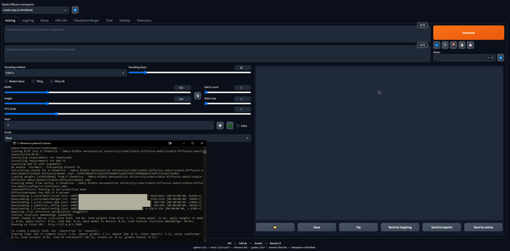

# Stable Diffusion Tests
I became interested in using SD to generate images for military applications. Most of the resources are taken from 4chan's NSFW boards, as anons use SD to make hentai. Interestingly, the canonical SD WebUI has built-in functionality with anime/hentai image boards... One of the first use cases of SD right after DALL-E was generating anime girls, so the jump to hentai is not surprising. 

Anyhow, the techniques from these weirdos are applicable to a variety of applications, most specifically LoRAs, which are like model fine-tuners. The idea is to work with specific LoRAs (e.g., military vehicles, aircraft, weapons, etc.) to generate synthetic image data for training vision models. Training new, useful LoRAs is also of interest. Later stuff may include inpainting for perturbation.

## Disclaimer
```Every link here may contain NSFW content, as most of the cutting-edge work on SD and LoRAs is with porn or hentai. So, please be wary when you are working with these resources. ```

-TP

# Play With It!
What can you actually do with SD? Huggingface and some others have some apps in-browser for you. Play around with them to see the power! What we will do in this guide is get the full, extensible WebUI to allow us to do anything we want.
* [Huggingface Text to Image SD Playground](https://huggingface.co/spaces/stabilityai/stable-diffusion)
* [Dreamstudio Text to Image SD App](https://beta.dreamstudio.ai/generate)
* [Dezgo Text to Image SD App](https://dezgo.com/)
* [Huggingface Image to Image SD Playground](https://huggingface.co/spaces/huggingface-projects/diffuse-the-rest)
* [Huggingface Inpainting Playground](https://huggingface.co/spaces/fffiloni/stable-diffusion-inpainting)

# Table of Contents
1. [The Basics](#the-basics)
    1. [Set up Local GPU usage](#set-up-local-gpu-usage)
    2. [Going Deeper](#going-deeper)
    3. [NovelAI Model](#novelai-model)
    4. [LoRA](#lora)
    5. [Playing with Models](#playing-with-models)
    6. [VAEs](#vaes)
    7. [Put it all Together](#put-it-all-together)
    8. [Getting Comfortable](#getting-comfortable)
    9. [Testing](#testing)
2. [Advanced](#advanced) (WIP)
    1. [Img2Img](#img2img)
    2. [Inpainting](#inpainting)
    3. [Extras](#checkpoint-merger)
    4. [Making New Stuff](#making-new-stuff)
        1. [Checkpoint Merger](#checkpoint-merger)
        2. [Training LoRAs](#training-loras)
3. [Google Colab Setup](#google-colab-setup) (WIP)

# The Basics
It's somewhat daunting to get into this... but 4channers have done a good job making this approachable. Below are the steps I took, in the simplest terms. Your intent is to get the Stable Diffusion WebUI (built with Gradio) running locally so you can start prompting and making images.

## Set up Local GPU Usage
We will do Google Colab Pro setup later, so we can run SD on any device anywhere we want; but to start, let's get the it setup on a PC. You need 16GB RAM, a GPU with 2GB VRAM, Linux or Windows 7+ and 20+GB disk space.
1. Finish the [starting setup guide](https://rentry.org/voldy)
    * I followed this up to step 7, after which it goes into the hentai stuff
    * Step 3 takes 15-45 minutes on average Internet speed, as the models are 5+ GB each
    * Step 7 can take upwards of half an hour and may seem "stuck" in the CLI
    * In step 3 I downloaded SD1.5, not the 2.x versions, as 1.5 produces much better results
    * [CivitAI](https://CivitAI.com/) has all the SD models; it's like HuggingFace but for SD specifically
2. Verify that the WebUI works
    1. Copy the URL the CLI outputs once done, e.g., ```127.0.0.1:7860``` (do **NOT** use Ctrl + C because this command can close the CLI)
    2. Paste into browser and voila; try a prompt and you're off to the races
    3. Images will be saved automatically when generated to ```stable-diffusion-webui\outputs\txt2img-images\<date>```



## Going Deeper

1. Read up on prompting techniques, because there are lots of things to know (e.g., positive prompt vs. negative prompt, sampling steps, sampling method, etc.)
    * [Definitive SD Prompting Guide](https://stable-diffusion-art.com/prompt-guide/) 
    * [4chan prompting tips](https://rentry.org/hdgpromptassist#terms) (NSFW)
2. Read up on SD knowledge in general:
    * [Stable Diffusion Compendium](https://www.sdcompendium.com/doku.php?id=start) (good outside resource)
    * [Stable Diffusion Links Hub](https://rentry.org/rentrysd) (incredible 4chan resource)
    * [Stable Diffusion Goldmine](https://rentry.org/sdgoldmine#prompt-database)
    * [Simplified SD Goldmine](https://rentry.org/sdhypertextbook)
    * [Random/Misc. SD Links](https://rentry.org/sdg-link)
    * [FAQ](https://rentry.org/hdgfaq) (NSFW)
    * [Another FAQ](https://rentry.org/sdg_FAQ)
3. Join the Stable Diffusion [Discord](https://discord.com/invite/stablediffusion)     
4. Mess around in the WebUI, play with different models, settings, etc.
    * Play with keywords like () and [] (increase and decrease emphasis, respectively)
    * Etc.

## NovelAI Model
The default model is pretty neat but, as is usually the case in history, sex drives most things. NovelAI (NAI) was an anime-focused SD content generation service and its main model was leaked. Most of the incredibly realistic images of SD-generated men and women you see (NSFW or not) come from this leaked model. 

In any case, it's just really good at generating people and most of the models or LoRAs you will play with merging are compatible with it because they are trained on anime images. Also, humans present a really good starting use case for fine-tuning exactly what LoRAs you want to use for professional purposes. You will be troubleshooting a lot and most of the guides out there are for images of women. Later we will get into  variable auto-encoders (VAEs), which brings true realism to the model.

1. Follow the [NovelAI Speedrun Guide](https://rentry.org/nai-speedrun)
    * You'll need to Torrent the leaked model or find it elsewhere
2. Once you get the files into the folder for the WebUI, ```stable-diffusion-webui\models\Stable-diffusion```, and select the model there, you should have to wait a few minutes while the CLI loads the VAE weights
    * If you have trouble here, copy the config.yaml file from the folder where the model was and follow the same naming scheme (like in this [guide](https://rentry.org/voldy#-novelai-setup-))
3. Recreate the Asuka image exactly, referring to the [troubleshooting guide](https://imgur.com/a/DCYJCSX) if it does not match
4. Find new SD models and LoRAs
    * [CivitAI](https://CivitAI.com/)
    * [Huggingface](https://huggingface.co/models?other=stable-diffusion)
    * [SDG Models](https://rentry.org/sdmodels)
    * [SDG Model Motherload](https://rentry.org/sdg-motherload) (NSFW)
    * [SDG LoRA Motherload](https://rentry.org/sdg-LoRA-motherload) (NSFW)
    * [Lots of popular models (also the prompting guide from earlier)](https://rentry.org/hdgpromptassist#models) (NSFW)

## LoRA
[Low-Rank Adaptation (LoRA)](https://huggingface.co/blog/lora) allows fine-tuning for a given model. In the WebUI, you can add LoRAs to a model like icing on a cake. Training new LoRAs is also pretty easy. There are other, "ancestral" means of fine-tuning (e.g., textual inversion and hypernetworks), but LoRAs are the state-of-the-art.

Here is a LoRA from CivitAI that generates [tanks](https://civitai.com/models/14234/ztz-99a-tank) and another that generates [fighter jets](https://civitai.com/models/6975/fighter-jet-lora). I will use the tank LoRA throughout the guide. Please note that this is not a very good LoRA, as it is meant for anime-style images, but it is fine to play around with.

1. Follow this [quick guide](https://rentry.org/hdgpromptassist#how-to-use-a-lora) to install the extension
2. You should now see an "Additional Networks" section in the UI
3. Put your LoRAs into ```stable-diffusion-webui\extensions\sd-webui-additional-networks\models\lora```
4. Select and go
    * Just know that any LoRA you download probably has info describing how to use it... like "use the keyword tank" or something; make sure wherever you download it from (e.g., CivitAI), you read its description


## Playing with Models
Building upon the previous section... different models have different training data and training keywords... so using booru tags on some models doesn't work very well. Below are some of the models I played with and the "instructions" for them.

[SDG Model Motherload](https://rentry.org/sdg-motherload), used to get most of the models, I'm just summarizing the instructions here for quick reference; most of the models are for literal porn, I focused on the realistic ones. Follow the links to see example prompts, images and detailed notes on using each of them.

* Default SD model (built-in)
* NovelAI model (from the [first guide](https://rentry.org/voldy))
* [Anything v3](https://huggingface.co/cag/anything-v3-1) - general purpose anime model
* [Dreamshaper](https://CivitAI.com/api/download/models/5636) - realism, all-purpose 
* [Deliberate](https://CivitAI.com/api/download/models/5616) - realism, fantasy, paintings, scenery
* [Neverending Dream](https://rentry.org/sdg-motherload#neverending-dream-ned) - realism, fantasy, good for people and animals
    * Uses the booru tag system
* [Epic Diffusion](https://rentry.org/sdg-motherload#epic-diffusion-11) - ultra-realism, intended to replace original SD
* [AbyssOrangeMix (AOM)](https://rentry.org/sdg-motherload#abyssorangemix-aom-various) - anime, realism, artistic, paintings, extremely common and good for testing
* [Kotosmix](https://rentry.org/sdg-motherload#kotosmix-v10) - general purpose, realism, anime, scenery, people, DPM++ 2M Karras sampler recommended

[CivitAI](https://CivitAI.com/) was used to get all the others. You need to **make an account** otherwise you will not be able to see NSFW stuff, including weapons and military equipment.  On CivitAI, some models (checkpoints) include VAEs; if it states this, download it as well and place it alongside the model.

* [Protogen x3.4](https://civitai.com/models/3666/protogen-x34-photorealism-official-release) - ultra-realism
    * Use trigger words: modelshoot style, analog style, mdjrny-v4-style, nousr robot
* [Dreamlike Photoreal 2.0](https://civitai.com/models/3811/dreamlike-photoreal-20) - ultra-realism
    * Use trigger word: photorealistic
* [SPYBG's Toolkit for Digital Artists](https://civitai.com/models/4118/spybgs-toolkit-for-digital-artists) - realism, concept art
    * Use trigger words: tk-char, tk-env

## VAEs
Variable Autoencoders make images look better, crisper, less blown out. Some also fix hands and faces. But it's mostly a saturation and shading thing. Explained [here](https://rentry.org/sdvae) and [here](https://rentry.org/hdgrecipes#vae-preview-images) (NSFW). The NovelAI / Anything VAE is commonly used. It's basically an add-on to your model, just like a LoRA.

Find VAEs at the [VAE List](https://rentry.org/sdvae#main-vaes):

* [NAI / Anything](https://civitai.com/models/66/anything-v3) - for anime models
    * Comes with the NAI model by default when you put it into the models folder
* [SD 1.5](https://huggingface.co/stabilityai/sd-vae-ft-mse-original/blob/main/vae-ft-mse-840000-ema-pruned.safetensors) - for realistic models

1. Download a VAE
2. Follow [this](https://rentry.org/sdvae#how-do-i-use-a-vae) quick section of the guide to set up VAEs in the WebUI
    * Make sure to put them in ```stable-diffusion-webui\models\VAE\```
3. Play around with making images with and without your VAE, to see the differences

## Put it all Together
Here are some general notes and helpful things I learned along the way that do not necessarily fit the chronological flow of this guide.

### The General SD Process
A good way to learn is to browse cool images on CivitAI, AIbooru or other SD sites (4chan, Reddit, etc.), open what you like and copy the generation parameters into the WebUI. Full disclosure: recreating an image exactly is not always possible, as described [here]. But you can generally get pretty close. To really play around, turn the CFG low so the model can get more creative. Try batches and walk away from the computer to come back to lots to pick through.

### Regenerating a Previously-Generated Image
To work from an SD-generated image that already exists; maybe someone sent it to you or you want to recreate one you made:

1. In the WebUI, go to the PNG Info tab
2. Drag and drop the image you are interested into the UI
    * They are saved in ```stable-diffusion-webui\outputs\txt2img-images\<date>```
3. See the used parameters on the right
    * Works because PNGs can store metadata
4. You can send it right to the txt2img page with the corresponding button
    * Might have to check back and forth to make sure the model, VAE and other parameters auto-populate correctly

Be aware, some sites remove PNG metadata when images are uploaded (e.g., 4chan), so look for URLs to the full images or use sites that retain SD metadata, like CivitAI or AIbooru.

### Troubleshooting Errors
I got a few errors now and again. Mostly out of memory (VRAM) errors that were fixed by lowering values on some parameters. Sometimes the Restore faces and Hires. fix settings can cause this. In the file ```stable-diffusion-webui\webui-user.bat```, on the line ```set COMMANDLINE_ARGS=```, you can put some flags that fix common errors.

* A NaN error, something to the effect of "a VAE produced a NaN something", add the parameter ```--disable-nan-check```
* If you ever get black images, add ```--no-half```
* If you keep running out of VRAM, add ```--medvram``` or for potato computers, ```--lowvram```
* Face restoration Codeformer fix [here](https://github.com/AUTOMATIC1111/stable-diffusion-webui/discussions/8416) (if it does break, try resetting your Internet first)

## Getting Comfortable
Some extensions can make using the WebUI better. Get the Github link, go to Extensions tab, install from URL; optionally, in the Extensions Tab, click Available, then Load From and you can browse extensions locally, this mirrors the extensions Github [wiki](https://github.com/AUTOMATIC1111/stable-diffusion-webui/wiki/Extensions).

* [Tag Completer](https://github.com/DominikDoom/a1111-sd-webui-tagcomplete) - Recommends and auto-completes booru tags as you type
* [Stable Diffusion Web UI State](https://github.com/ilian6806/stable-diffusion-webui-state) - Preserves the UI state even after restarting
* [Test My Prompt](https://github.com/Extraltodeus/test_my_prompt) - A script that you can run to remove individual words from your prompt to see how it affects image generation
* [Model-Keyword](https://github.com/mix1009/model-keyword) - Autofills keywords associated with some models and LoRAs, pretty well-maintained and up-to-date as of Apr. 2023
* [NSFW Checker](https://github.com/AUTOMATIC1111/stable-diffusion-webui-nsfw-censor) - Blacks out NSFW images; useful if you are working in an office, as a lot of good models allow NSFW content and you may not want to see that at work
* [Gelbooru Prompt](https://github.com/antis0007/sd-webui-gelbooru-prompt) - pulls tags and creates an automatic-prompt from any Gelbooru image using its hash
* [booru2prompt](https://github.com/Malisius/booru2prompt) - similar to Gelbooru Prompt but a bit more functionality

## Testing
So now you have some models, LoRAs and prompts... how can you test to see what works best? Below the Additional Networks pane, there is the Script dropdown. In here, click X/Y/Z plot. In the X type, select Checkpoint name; in the X values, click the button to the right to paste all of your models. In the Y type, try VAE, or perhaps seed, or CFG scale. Whatever attribute you pick, paste (or enter) the values you want to graph. For instance, if you have 5 models and 5 VAEs, you will make a grid of 25 images, comparing how each model outputs with each VAE. This is very versatile and can help you decide what to use. Just beware that if your X or Y axes are models of VAEs, it has to load the model or VAE weights for every combination.

A really good resource on SD comparisons can be found [here](https://github.com/ilian6806/stable-diffusion-webui-state) (NSFW). There are lots of links to follow. You can begin to form an understanding on how the various models, VAEs, LoRAs, parameter values and so on affect image generation.

# Advanced
In this section are the more advanced things you can do once you get a good familiarity with using models, LoRAs, VAEs, prompting, parameters, scripting and extensions in the WebUI.

## Img2Img
TODO

## Inpainting
TODO

## Extras
TODO

## Making New Stuff
* Browse every topic of interest [here](https://rentry.org/rentrysd)
  * [Training LoRAs](https://rentry.org/ezlora)
  * [More general LoRA info](https://rentry.org/RentrySD/#1162-lora-guides-and-info)
  * [Merging models](https://rentry.org/hdgrecipes)
  * [Mixing models](https://rentry.org/RentrySD/#132-model-mixing)

### Checkpoint Merger
TODO

### Training LoRAs
TODO

# Google Colab Setup
TODO

# Junkyard
Stuff I don't know much about but need to look into

There is a process you can follow to get good results over and over... this will be refined over time.

1. TODO
2. Highres fix, [here](https://rentry.org/hiresfixjan23)
3. upscaling, all over but [here](https://rentry.org/hdgfaq) mostly 


controlnet? [here](https://civitai.com/models/9251/controlnet-pre-trained-models)

wildcards?
prompt languages?
prompt substep inputs (image on phone)?

chatgpt integration?

xformers

restore faces and hires fix?? i use them but how do they work?